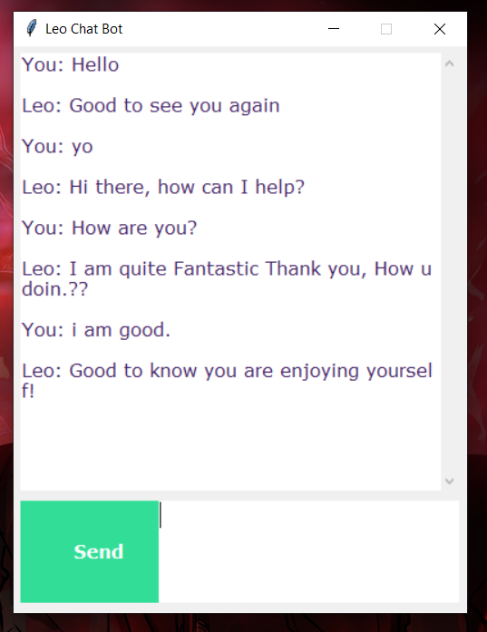
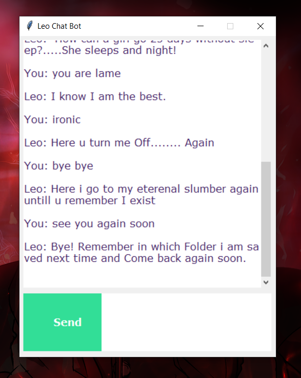

# Leo_The_Chatbot
# Spam SMS Detection Project

## Project Overview
• Created a chat bot in python that can have basic conversations with the user.

• It is a retrieval based chatbot that uses predefined input patterns and responses in the json.

## Resources Used
• Packages: **numpy,keras, tensorflow, pickle, nltk.** 

## Preprocessing
• Tokenizing the patterns by words 
• Lemmatizing the words 
• Building a corpus of messages

## Model Building and Evaluation
**Metric: F1-Score** 
• A Deep Neural Network is made having 3 layers.

• Trained the model for 200 epochs to get the desired accuracy of >0.95

## Model Deployment

• Repository Link: [Github Link](https://github.com/JSPurewal/Leo_The_Chatbot) 
